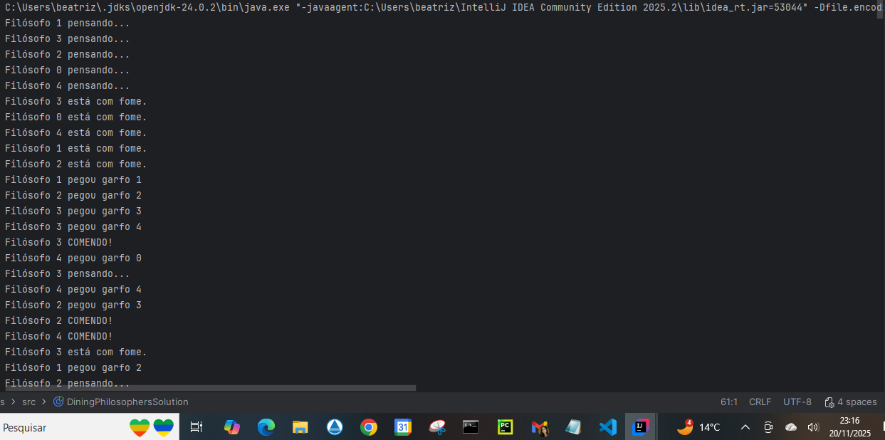

# Parte 1 — Jantar dos Filósofos (TDE3 – Sistemas Operacionais)

## Objetivo
Simular o problema clássico do Jantar dos Filósofos, demonstrar o impasse no protocolo ingênuo e implementar uma solução que evita deadlock por meio de **hierarquia de recursos**.

---

## Dinâmica do problema

Cinco filósofos sentam-se em uma mesa circular. Cada um alterna entre:

- **Pensar**
- **Ficar com fome**
- **Comer**

Para comer, o filósofo deve adquirir **dois garfos** (recursos exclusivos).  
O problema surge quando todos tentam pegar os garfos simultaneamente.

---

## Protocolo ingênuo — com deadlock

No protocolo errado, cada filósofo:

1. Pega primeiro o garfo da esquerda  
2. Depois tenta pegar o da direita  

Se todos fizerem isso ao mesmo tempo, cada um segura apenas um garfo e espera pelo outro, formando uma espera circular.  
Isso satisfaz **todas as quatro condições de Coffman**, caracterizando deadlock:

1. Exclusão mútua ✔  
2. Manter-e-esperar ✔  
3. Não preempção ✔  
4. Espera circular ✔

Código: `DiningPhilosophersDeadlock.java`

---

## Solução — Hierarquia de recursos

Para evitar o impasse, adotamos uma **ordem global fixa**:

Cada filósofo sempre adquire primeiro o garfo de **menor índice**, depois o de **maior índice**.

Isso elimina a condição de **espera circular**, impossibilitando o deadlock.

Código: `DiningPhilosophersSolution.java`

---

## Saídas / prints

Abaixo estão os registros de execução dos dois protocolos implementados:

### Protocolo Ingênuo (com risco de impasse)
O print abaixo mostra a execução do algoritmo ingênuo, onde cada filósofo tenta pegar primeiro o garfo da esquerda e depois o da direita.  
É possível observar que o sistema entra em impasse, pois todos ficam aguardando o segundo garfo.


---

### Protocolo com Hierarquia de Recursos (sem impasse)
O print abaixo mostra o funcionamento correto utilizando a estratégia de hierarquia de recursos.  
Os filósofos alternam entre pensar, ter fome e comer sem travamentos.




## Execução e Compilação 

### Executar
```bash
javac DiningPhilosophersDeadlock.java
javac DiningPhilosophersSolution.java
