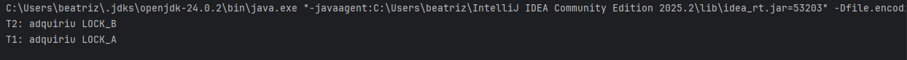
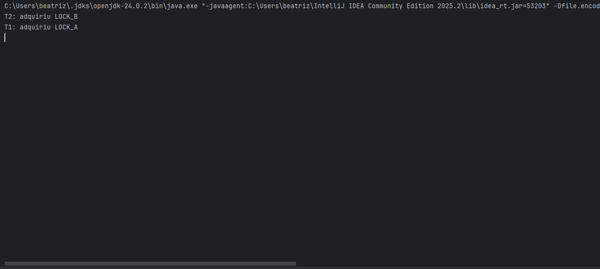
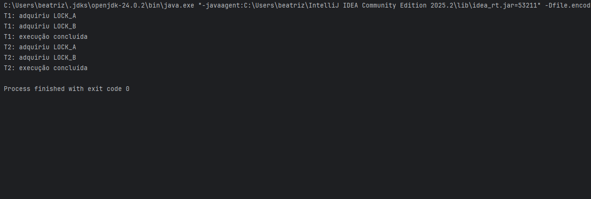

# Parte 3 — Deadlock

## Objetivo
Reproduzir um deadlock envolvendo duas threads e dois locks e, em seguida, implementar uma solução utilizando uma ordem global de aquisição de recursos para prevenir a espera circular.

---

## Descrição do problema

Duas threads tentam adquirir dois locks (A e B) em ordens opostas.  
Quando cada thread obtém um lock e passa a aguardar pelo segundo, o sistema entra em espera circular, caracterizando deadlock.

As condições de Coffman presentes são:
- exclusão mútua,  
- manter-e-esperar,  
- não preempção,  
- espera circular (responsável crítica pelo impasse).
  
Código: `DeadlockDemo.java`

---

## Solução

Adotar uma **ordem global** de aquisição dos recursos.  
Todas as threads passam a adquirir sempre `LOCK_A` antes de `LOCK_B`, eliminando a possibilidade de espera circular.

Código: `DeadlockResolvido.java`

---

## Saídas / prints

### Logs da Execução com Deadlock
Os logs abaixo mostram claramente a ocorrência do deadlock.  
Cada thread adquire o primeiro lock e fica indefinidamente bloqueada aguardando o segundo.



---

## Execução Travada (Deadlock)
O print abaixo mostra a execução travada, sem progresso, após ambas as threads entrarem em espera circular.



---

## Execução Corrigida (Sem Deadlock)
Abaixo está o print da execução após aplicar a hierarquia de recursos, garantindo ordem fixa na aquisição dos locks.  
A execução segue normalmente e finaliza sem travamentos.




## Compilação e execução

### Executar
```bash
javac DeadlockDemo.java
javac DeadlockResolvido.java
